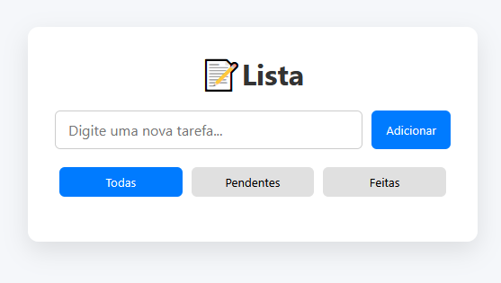

# 📝 To-Do List Simples

Um proejto simples e elegante para criar, visualizar e organizar tarefas do dia a dia.

---

## ✨ Funcionalidades

- ✅ Adicionar novas tarefas.
- 📋 Visualizar tarefas em três modos:
  - Todas
  - Pendentes
  - Concluídas
- 🔁 Alternar entre concluída e pendente com um clique.
- ❌ Excluir tarefas.
- 🎨 Interface limpa e responsiva.
  
---

## 🖼️ Preview

---

## 🚀 Tecnologias Utilizadas

| Tecnologia | Descrição |
|------------|-----------|
| HTML5      | Estrutura da aplicação |
| CSS3       | Estilização com responsividade e transições |
| JavaScript | Lógica funcional (sem frameworks) |
